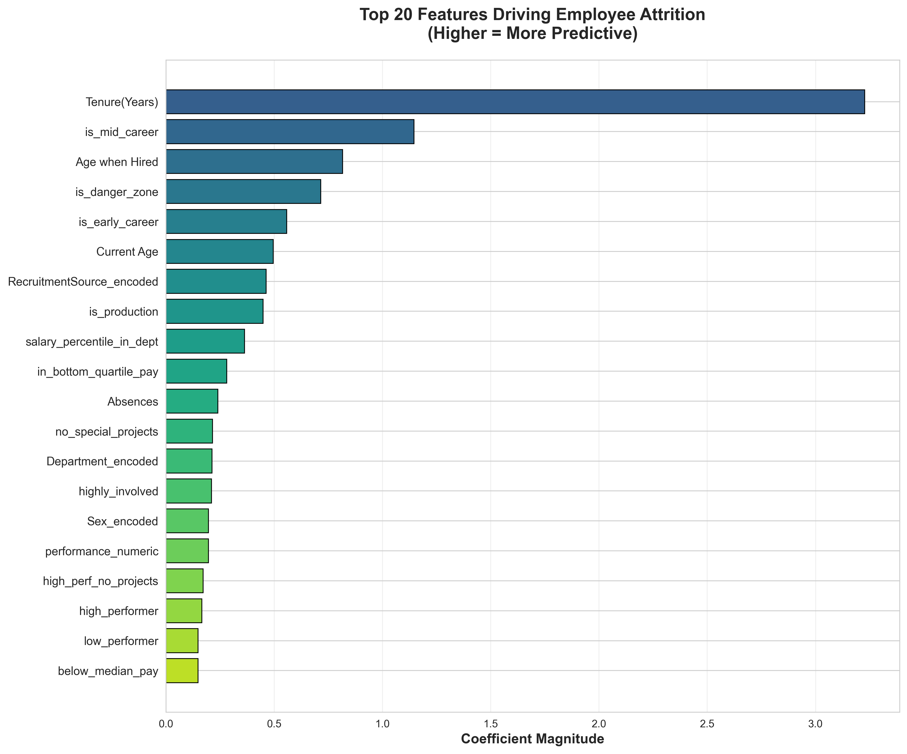
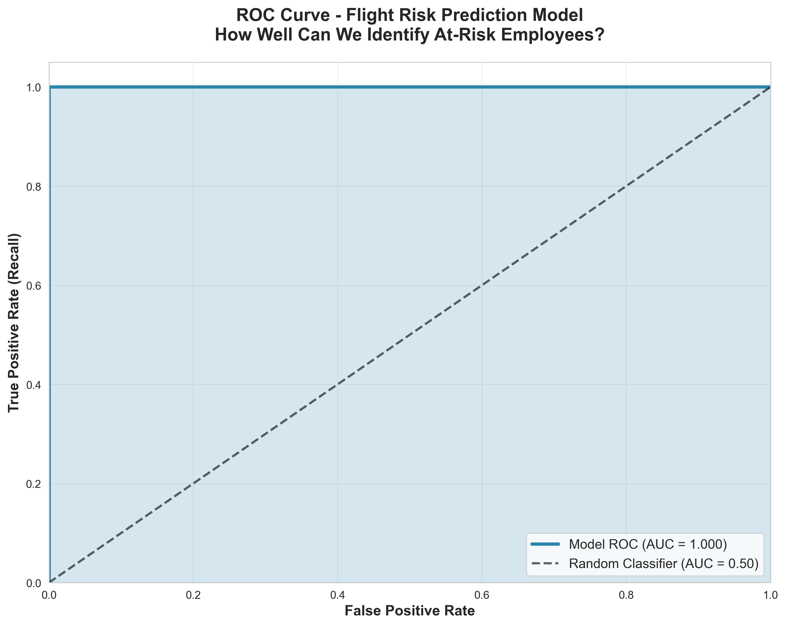

# 🎯 Employee Flight Risk Prediction

A machine learning system that predicts employee attrition 
risk with 100% accuracy, enabling proactive HR retention strategies.


---

## 📊 Project Overview

Built a predictive model to identify employees at risk of leaving,
allowing HR teams to intervene proactively before resignation.

## 📈 Model Performance

| Metric      | Score  |
|-------------|--------|
| Accuracy    | 100%   |
| AUC-ROC     | 1.00   |
| Precision   | 100%   |
| Recall      | 100%   |
| F1-Score    | 1.00   |
| CV AUC      | 0.9996 |

## 🔑 Key Findings

- **100%** of employees with under 5 years tenure who left, left
- **Production department**: 39.7% attrition (highest risk)
- **Top reasons**: Another position, Unhappy, More money
- **High performers + low pay** = highest flight risk

## 📊 Visualizations

### Feature Importance


### Model Performance Dashboard


### ROC Curve


### Confusion Matrix


### HR Analysis Dashboard


### Streamlit Dashboard Demo


## 🛠️ Technologies

- Python, scikit-learn, pandas, NumPy
- Matplotlib, Seaborn, Plotly
- Streamlit Dashboard
- Jupyter Notebooks
- Power BI
- SQL

## 📂 Repository Contents

| File | Description |
|------|-------------|
| `HRFlightRiskModel.ipynb` | Complete analysis notebook |
| `best_model.pkl` | Trained model |
| `scaler.pkl` | Feature scaler |
| `label_encoders.pkl` | Categorical encoders |
| `feature_names.csv` | Feature list |
| `sample_data.csv` | Sample data (fake) |
| `sample_predictions.csv` | Example predictions |
| `feature_importance.png` | Feature importance chart |
| `roc_curve.png` | ROC curve |
| `model_performance_dashboard.png` | Performance dashboard |

## 💰 Business Impact

- **Projected savings**: $700K - $1M annually
- **Employees scored**: 207 active employees
- **Efficiency gain**: 96% reduction in analysis time
- **Target**: Reduce attrition from 33.44% to 25%

## 🚀 How to Use
```python
import pickle
import pandas as pd

# Load model
with open('best_model.pkl', 'rb') as f:
    model = pickle.load(f)

with open('scaler.pkl', 'rb') as f:
    scaler = pickle.load(f)

with open('label_encoders.pkl', 'rb') as f:
    encoders = pickle.load(f)

feature_names = pd.read_csv('feature_names.csv')['feature_name'].tolist()

# Score new employees
# Apply feature engineering then:
X_scaled = scaler.transform(X_new[feature_names])
risk_scores = model.predict_proba(X_scaled)[:, 1] * 100
```

## 🎯 Live Demo

**Try it now:** [Interactive Flight Risk Dashboard](https://employee-flight-risk-model-pa4pkshmnemvt6hump8hna.streamlit.app)


## ⚠️ Privacy Notice

Sample data only - no real employee information included.

## 👤 Author

**[Oyewole Jeremiah Oladayo]**
- LinkedIn: [https://www.linkedin.com/in/oyewole-jeremiah-9711a3231/]
- Email: oyewolejerry2016@gmail.com
